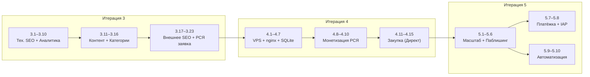

# MAD GAMES — Стратегия

## Глобальная цель

Сайт-каталог браузерных игр (свои + паблишинг сторонних разработчиков) с тремя источниками дохода:

```
1. Реклама РСЯ        — пассивный доход от показов на сайте
2. Закупка трафика     — Директ → РСЯ, окупаемость через рекламу
3. Покупки в играх     — платёжка + IAP SDK для Unity WebGL
```

Стратегическая воронка:

```
Контент (игры) → SEO (органика) → Аналитика → Монетизация (РСЯ) → Закупка (Директ) → IAP
      ↑                                                                              ↑
  фундамент                                                                     масштаб
```

---

## Текущий статус

| Аспект | Статус | Ref |
|---|---|---|
| Сайт (Next.js, дизайн, компоненты) | ✅ Готово | [ROADMAP §Выполнено] |
| Деплой (GitHub Pages) | ✅ Готово | [ROADMAP §TODO] |
| Игры в каталоге | ⚠️ 1 шт (нужно 5+) | [ROADMAP §Контент] |
| Техническое SEO | ❌ Нет | [MARKETING §1] |
| Аналитика | ❌ Нет | [MARKETING §3] |
| Поисковики (Вебмастер, GSC) | ❌ Нет | [MARKETING §2] |
| Монетизация (РСЯ) | ❌ Placeholder-ы | [MARKETING §6] |
| Закупка трафика (Директ) | ❌ Нет | [MARKETING §7] |
| Платёжка / IAP | ❌ Нет | — |

---

## Итерация 3: Контент + SEO + Аналитика

> **Цель**: 5+ игр, сайт проиндексирован, аналитика работает, заявка в РСЯ подана.

### Приоритет 1 — Техническое SEO + Аналитика (1–2 дня) ✅

> Можно сделать прямо сейчас, не зависит от контента.

- [x] 3.1 `public/robots.txt` — разрешить индексацию, указать sitemap — [MARKETING §1]
- [x] 3.2 `public/sitemap.xml` — генерировать скриптом при build — [MARKETING §1]
- [x] 3.3 `metadataBase` в `layout.tsx` — [ROADMAP §TODO], [MARKETING §1]
- [x] 3.4 Schema.org JSON-LD (`VideoGame`) на страницах игр — [MARKETING §1]
- [x] 3.5 `alt` на все изображения — [MARKETING §1]
- [x] 3.6 Favicon + Apple Touch Icon + `manifest.json` — [ROADMAP §TODO]
- [x] 3.7 Open Graph + Twitter Card мета-теги — [ROADMAP §TODO]
- [x] 3.8 Canonical URL на каждой странице — [MARKETING §1]
- [x] 3.9 Яндекс.Метрика — счётчик + цели (Play, время, глубина) — [MARKETING §3]
- [x] 3.10 Вебвизор (запись сессий) — [MARKETING §3]

### Приоритет 2 — Контент (1–2 недели)

> Главный блокер для всего остального. Без игр нет трафика, без трафика нет денег.

- [ ] 3.11 Расширить модель `Game` — добавить `category`, `tags`, `developer`, `publishedAt`, `shortDescription` — [ROADMAP §БД]
- [ ] 3.12 Добавить 3–5 игр (свои + open-source + паблишинг) — [ROADMAP §Контент]
- [ ] 3.13 Обложка + превью-видео для каждой игры — [ROADMAP §Превью-видео]
- [ ] 3.14 SEO-описания для каждой игры (ключевые слова: жанр, бесплатно, онлайн, браузер) — [MARKETING §4]
- [ ] 3.15 Страницы категорий `/category/[slug]` с уникальным `<h1>` и `<meta>` — [MARKETING §4]
- [ ] 3.16 Компонент `Breadcrumbs.tsx` + Schema.org `BreadcrumbList` — [MARKETING §4]

### Приоритет 3 — Внешнее SEO + Подготовка к монетизации (неделя 3)

> Запускать после наполнения контентом.

- [ ] 3.17 Яндекс.Вебмастер — зарегистрировать, отправить sitemap — [MARKETING §2]
- [ ] 3.18 Google Search Console — аналогично — [MARKETING §2]
- [ ] 3.19 Зарегистрировать игры на itch.io, GameJolt — [MARKETING §5]
- [ ] 3.20 Посты в VK gamedev-сообществах — [MARKETING §5]
- [ ] 3.21 Создать Telegram-канал MAD GAMES — [MARKETING §5]
- [ ] 3.22 Страницы «О проекте», Privacy Policy, Terms of Service
- [ ] 3.23 Подать заявку в РСЯ (partner.yandex.ru) — [MARKETING §6]

### UX-улучшения (по ходу)

- [ ] 3.24 Кастомная 404-страница
- [ ] 3.25 Loading skeleton для карточек
- [ ] 3.26 Мобильная оптимизация (тест на реальных устройствах) — [ROADMAP §Карточка]
- [ ] 3.27 Кнопки «Поделиться» (VK, Telegram, копировать ссылку)

### ✅ Критерии завершения итерации 3

- [ ] 5+ игр в каталоге
- [ ] Все страницы в индексе Яндекс и Google
- [x] Яндекс.Метрика работает, цели настроены
- [ ] Заявка в РСЯ подана
- [ ] 5+ внешних ссылок (itch.io, GameJolt, VK, Telegram)
- [ ] Страницы категорий существуют
- [ ] Privacy Policy и Terms of Service на сайте

---

## Итерация 4: VPS + Монетизация + Закупка трафика

> **Цель**: переехать на VPS, начать зарабатывать на рекламе, протестировать закупку трафика.

### Приоритет 1 — VPS и серверная инфраструктура

| # | Задача | Ref |
|---|---|---|
| 4.1 | Купить VPS (2 ГБ RAM, 20+ ГБ NVMe, Москва) | [ROADMAP §VPS] |
| 4.2 | Dockerfile (multi-stage build) | [ROADMAP §Шаг 6] |
| 4.3 | docker-compose.yml (Next.js + nginx) | [ROADMAP §Шаг 6] |
| 4.4 | nginx.conf — прокси, кеш `.wasm`/`.data`, gzip | [ROADMAP §VPS] |
| 4.5 | Certbot для SSL | [ROADMAP §Шаг 6] |
| 4.6 | Перенести DNS с GitHub Pages на VPS | [ROADMAP §Шаг 6] |
| 4.7 | SQLite вместо JSON (+ миграция данных) | [ROADMAP §БД] |

### Приоритет 2 — Монетизация

| # | Задача | Ref |
|---|---|---|
| 4.8 | Получить одобрение РСЯ, создать RTB-блоки | [MARKETING §6] |
| 4.9 | Заменить placeholder-баннеры на реальные `blockId` | [ROADMAP §РСЯ] |
| 4.10 | Замерить RPM (доход на 1000 показов) | [MARKETING §KPI] |

### Приоритет 3 — Закупка трафика (тест)

| # | Задача | Ref |
|---|---|---|
| 4.11 | Аккаунт рекламодателя в Яндекс.Директ | [MARKETING §7] |
| 4.12 | Кампания РСЯ — текстово-графические объявления | [MARKETING §7] |
| 4.13 | Создать 3–5 креативов вручную (скриншоты геймплея + CTA) | [MARKETING §8] |
| 4.14 | Тестовый бюджет 300–500₽/день, 2 недели | [MARKETING §7] |
| 4.15 | Считать unit-экономику: CPA < RPM → закупка в плюс | [MARKETING §KPI] |

### ✅ Критерии завершения итерации 4

- [ ] Сайт работает на VPS с nginx + SSL
- [ ] РСЯ-баннеры показывают реальную рекламу
- [ ] Посчитана unit-экономика (RPM, CPA, ROI)
- [ ] Есть понимание: закупка в плюс или нет

---

## Итерация 5: Масштабирование + Паблишинг + IAP

> **Цель**: конвейер добавления игр, сторонние разработчики, встроенные покупки.

| # | Задача | Ref |
|---|---|---|
| 5.1 | Админ-панель (загрузка игр через веб-интерфейс) | [ROADMAP §Итерация 3] |
| 5.2 | Паблишинг-пайплайн: форма для разработчиков + требования к билду | — |
| 5.3 | 10+ игр в каталоге | [ROADMAP §Итерация 3] |
| 5.4 | Категории и фильтры (жанр, популярность, новинки) | [ROADMAP §Итерация 3] |
| 5.5 | Скрипт автогенерации креативов (`sharp`/`puppeteer`) | [MARKETING §8] |
| 5.6 | CDN для тяжёлых файлов (.wasm, .data) | [ROADMAP §Итерация 3] |
| 5.7 | Подключить платёжку (ЮКасса / CloudPayments) | — |
| 5.8 | IAP SDK для Unity WebGL (JS ↔ C# bridge) | — |
| 5.9 | Рейтинг / счётчик просмотров | [ROADMAP §Итерация 3] |
| 5.10 | Директ API — автоматическое создание кампаний для новых игр | [MARKETING §8] |

---

## Карта зависимостей



---

## Справочник ссылок

| Ref | Документ | Раздел |
|---|---|---|
| [ROADMAP §Выполнено] | `ROADMAP.md` | ✅ Выполнено (Итерация 2) |
| [ROADMAP §TODO] | `ROADMAP.md` | 📋 TODO (Итерация 2 — осталось) |
| [ROADMAP §Контент] | `ROADMAP.md` | TODO → Контент |
| [ROADMAP §РСЯ] | `ROADMAP.md` | РСЯ (Рекламная Сеть Яндекса) |
| [ROADMAP §БД] | `ROADMAP.md` | БД (SQLite) |
| [ROADMAP §VPS] | `ROADMAP.md` | VPS |
| [ROADMAP §Шаг 6] | `ROADMAP.md` | Шаг 6. Docker + VPS + деплой |
| [ROADMAP §Превью-видео] | `ROADMAP.md` | Превью-видео |
| [ROADMAP §Карточка] | `ROADMAP.md` | Карточка игры |
| [ROADMAP §Итерация 3] | `ROADMAP.md` | Отложено на итерацию 3 |
| [MARKETING §1] | `MARKETING.md` | Этап 1: Техническое SEO |
| [MARKETING §2] | `MARKETING.md` | Этап 2: Регистрация в поисковиках |
| [MARKETING §3] | `MARKETING.md` | Этап 3: Аналитика |
| [MARKETING §4] | `MARKETING.md` | Этап 4: Контент и On-Page SEO |
| [MARKETING §5] | `MARKETING.md` | Этап 5: Внешнее SEO и ссылки |
| [MARKETING §6] | `MARKETING.md` | Этап 6: Монетизация — РСЯ на сайте |
| [MARKETING §7] | `MARKETING.md` | Этап 7: Закупка трафика — Директ → РСЯ |
| [MARKETING §8] | `MARKETING.md` | Этап 8: Автоматизация креативов |
| [MARKETING §KPI] | `MARKETING.md` | KPI и метрики |
